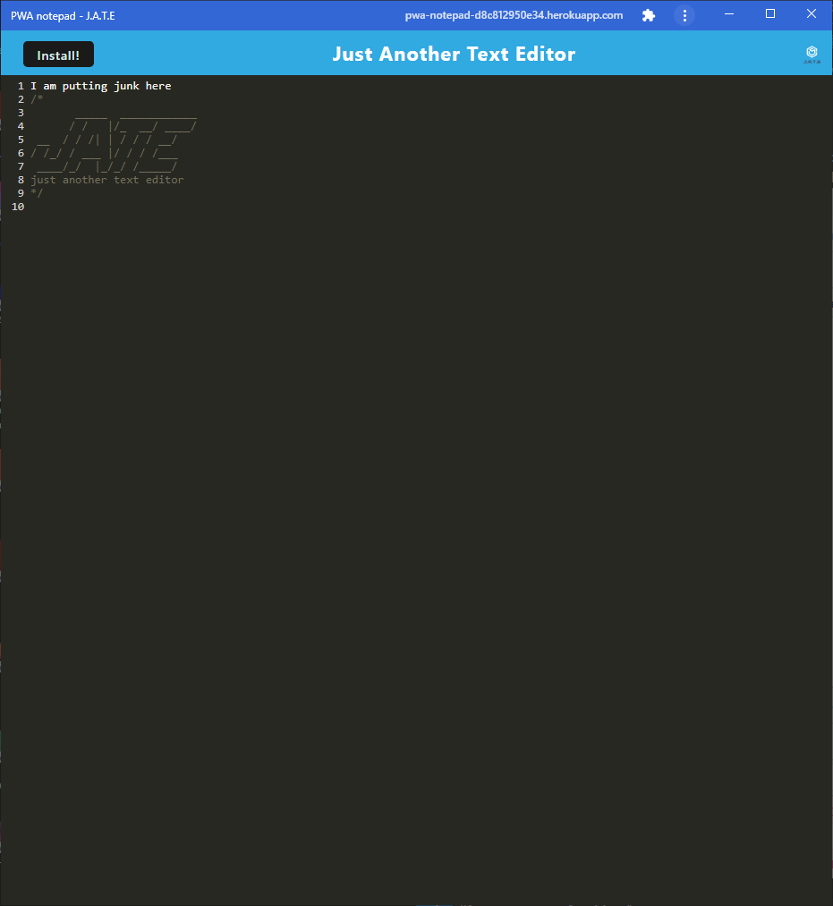
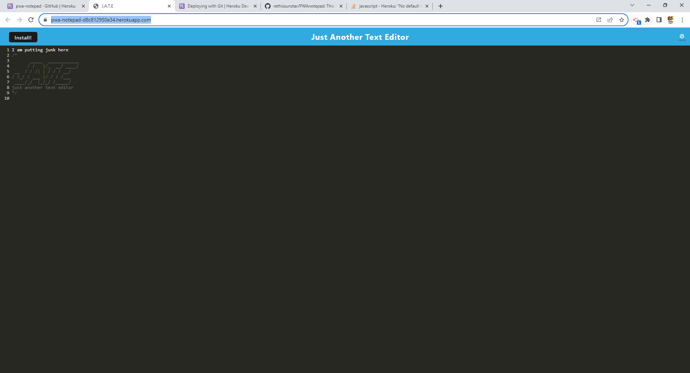

# PWAnotepad
This is a pad that can be installed on a browser that will maintain a database and cached information for speed.

 ## installation: 
"To install this you just have to click the download icon in the address bar."

 ## Description: 
"This is an app that allows you to take notesonline or offline once loaded onto the device in question.  It will remember and you can download by going to the address bar"

 ## Usage: 
"head to the website and it will cache the information that you type.  You can  edit and update. and download the app itself on your device"

 ## License: 
"MIT License"

 ## Contributors: 
"I had some help from Marco Severino with some errors I was experiencing."

 ## Github link: 
https://github.com/rethissunstar/PWAnotepad

 ## test: 
"head on over to heroku https://pwa-notepad-d8c812950e34.herokuapp.com/"

## Resources
basecode comes from Xandromus on github
Activity 15 to 26 for code snippets
https://developer.chrome.com/docs/workbox/modules/workbox-cacheable-response/
https://stackoverflow.com/questions/56244300/indexeddb-idbobjectstore-add-error-a-generated-key-could-not-be-inserted-into

## Pictures of deployed

